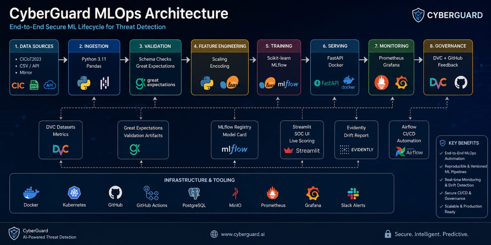
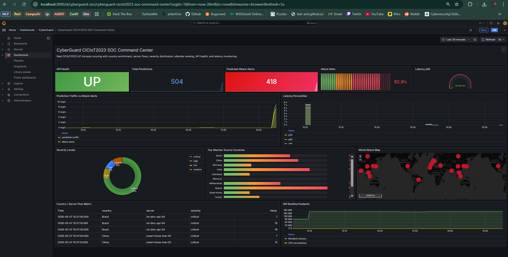
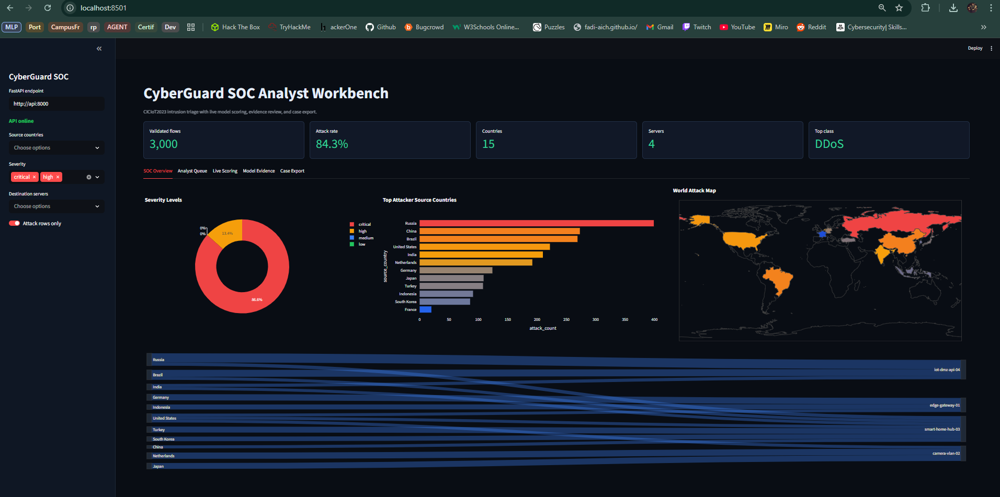
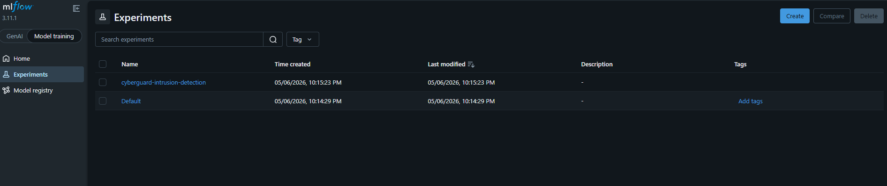
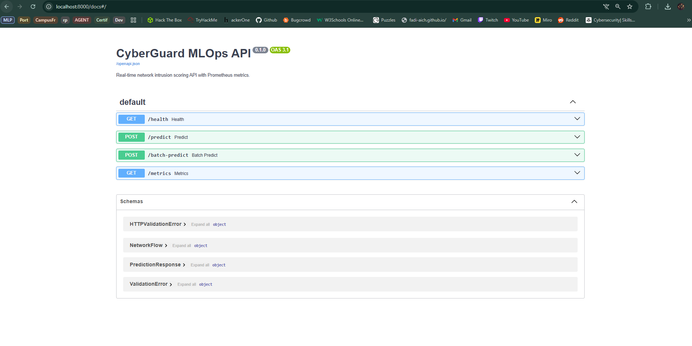

# CyberGuard MLOps

CyberGuard MLOps is an end-to-end cybersecurity Machine Learning Operations project for IoT intrusion detection. It uses a real CICIoT2023 sample, trains and tracks intrusion-detection models, serves the selected model through FastAPI, monitors production signals with Prometheus and Grafana, orchestrates the workflow with Airflow, and provides a Streamlit SOC analyst workbench.



## Highlights

- Real public dataset: CICIoT2023, released in 2023 by the Canadian Institute for Cybersecurity.
- Reproducible data and model pipeline with DVC.
- Data validation with schema checks and Great Expectations artefacts.
- Model comparison with Logistic Regression, Random Forest, and Gradient Boosting.
- Experiment tracking and model registry with MLflow.
- REST inference API with FastAPI and Prometheus metrics.
- Docker Compose stack for API, MLflow, Prometheus, Grafana, Airflow, and Streamlit.
- SOC-style Grafana dashboard with attack ratio, latency, source countries, severity, and server flow views.
- Streamlit analyst UI for triage, live scoring, evidence review, and incident-note export.
- CI/CD with GitHub Actions: formatting, linting, typing, tests, and Docker builds.

## Screenshots

| SOC dashboard | Analyst workbench |
| --- | --- |
|  |  |

| MLflow registry | FastAPI docs |
| --- | --- |
|  |  |

## Results

The final selected model is Gradient Boosting, chosen by F1-score.

| Model | Accuracy | Precision | Recall | F1 | ROC-AUC |
| --- | ---: | ---: | ---: | ---: | ---: |
| Logistic Regression | 0.835 | 1.000 | 0.804 | 0.892 | 0.938 |
| Random Forest | 0.891 | 0.982 | 0.887 | 0.932 | 0.961 |
| Gradient Boosting | 0.903 | 0.962 | 0.921 | 0.941 | 0.956 |

## Architecture

```text
CICIoT2023 data
  -> ingestion and validation
  -> DVC pipeline
  -> feature processing
  -> model training and MLflow tracking
  -> model registry and model card
  -> FastAPI serving
  -> Prometheus metrics
  -> Grafana SOC dashboard
  -> Evidently drift report
  -> Streamlit analyst workbench
  -> Airflow orchestration and GitHub Actions CI
```

## Repository layout

```text
.
|-- dags/                     # Airflow DAG
|-- data/                     # Raw and processed CICIoT2023 sample
|-- local_inference/          # Offline/local inference helpers
|-- models/                   # Trained model, metrics, model card
|-- monitoring/               # Prometheus and Grafana provisioning
|-- reports/                  # Validation, drift, and SOC reports
|-- repport/                  # LaTeX report source
|-- screenshots/              # Report and README evidence images
|-- scripts/                  # Traffic replay and utility scripts
|-- src/cyberguard_ml/        # Main Python package
`-- tests/                    # Pytest suite
```

## Quick start

Requirements:

- Python 3.11
- Docker Desktop
- Git

Create the virtual environment and install dependencies:

```powershell
py -3.11 -m venv .venv
.\.venv\Scripts\python.exe -m pip install --upgrade pip
.\.venv\Scripts\python.exe -m pip install -r requirements.txt
.\.venv\Scripts\Activate.ps1
$env:PYTHONPATH='src'
```

Generate the data, validation reports, model, and drift artefacts:

```powershell
.\.venv\Scripts\python.exe -m cyberguard_ml.pipeline.ingest_ciciot2023 --rows 3000 --page-size 100 --offset 0
.\.venv\Scripts\python.exe -m cyberguard_ml.pipeline.validate_data
.\.venv\Scripts\python.exe -m cyberguard_ml.pipeline.great_expectations_check
.\.venv\Scripts\python.exe -m cyberguard_ml.pipeline.train_model
.\.venv\Scripts\python.exe -m cyberguard_ml.monitoring.drift_report
.\.venv\Scripts\python.exe -m cyberguard_ml.monitoring.soc_report
```

Run the DVC pipeline:

```powershell
.\.venv\Scripts\dvc.exe repro
.\.venv\Scripts\dvc.exe dag
.\.venv\Scripts\dvc.exe metrics show
.\.venv\Scripts\dvc.exe status
```

Start the full local stack:

```powershell
docker compose --profile airflow up -d mlflow api prometheus grafana airflow soc-ui traffic-replay
docker compose --profile airflow ps
```

The `traffic-replay` container automatically sends CICIoT2023 rows to the API every two minutes, which keeps Prometheus and Grafana populated. To run the replay manually instead:

```powershell
.\.venv\Scripts\python.exe scripts\replay_ciciot2023_traffic.py --rows 500 --sleep 0.02 --timeout 30 --retries 2
```

## Service URLs

| Service | URL |
| --- | --- |
| FastAPI docs | <http://localhost:8000/docs> |
| MLflow | <http://localhost:5001> |
| Prometheus | <http://localhost:9090/targets> |
| Grafana | <http://localhost:3000/d/cyberguard-soc/cyberguard-ciciot2023-soc-command-center> |
| Airflow | <http://localhost:8080> |
| Streamlit SOC UI | <http://localhost:8501> |

Grafana credentials:

```text
username: admin
password: admin
```

## Quality checks

```powershell
.\.venv\Scripts\python.exe -m pytest
.\.venv\Scripts\python.exe -m black --check src tests dags scripts
.\.venv\Scripts\python.exe -m isort --check-only src tests dags scripts
.\.venv\Scripts\python.exe -m ruff check src tests dags scripts
.\.venv\Scripts\python.exe -m mypy src
```

## API example

Health check:

```powershell
Invoke-RestMethod http://localhost:8000/health
```

Prediction requests can be sent from the Swagger UI at:

```text
http://localhost:8000/docs
```

## Report

The LaTeX report source is in `repport/`. A ready-to-upload Overleaf zip can be generated from the report source and screenshots.

Compile locally:

```powershell
Set-Location -LiteralPath '.\repport'
pdflatex -interaction=nonstopmode -halt-on-error main.tex
biber main
pdflatex -interaction=nonstopmode -halt-on-error main.tex
pdflatex -interaction=nonstopmode -halt-on-error main.tex
```

## Dataset note

CICIoT2023 is used for educational MLOps demonstration. The repository uses a reproducible sample, not the full benchmark. SOC enrichment fields such as country, source IP, destination server, and severity are used for monitoring visuals and analyst triage, not as model features.
